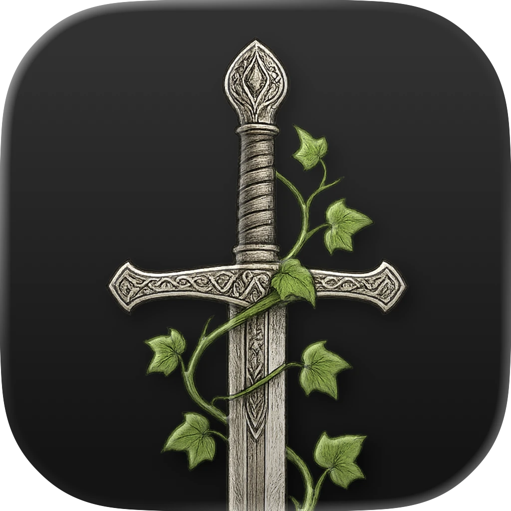
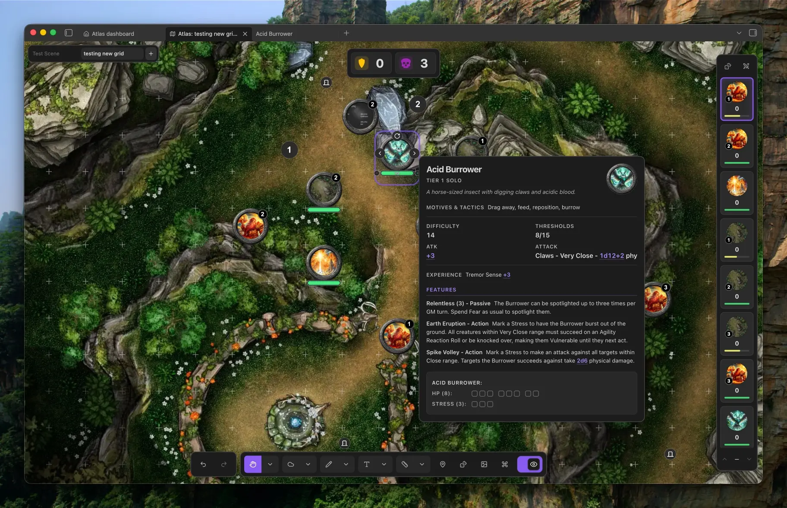
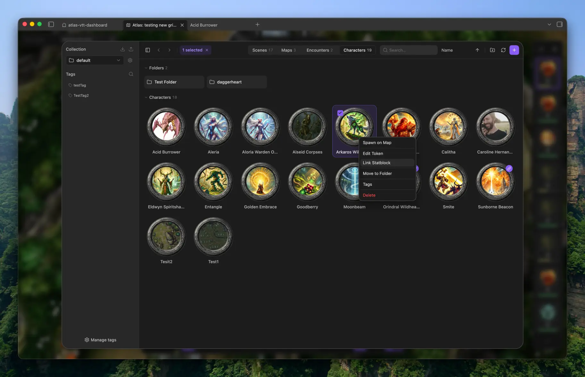

<p align="center">
  
</p>

# Atlas VTT

A game system agnostic virtual tabletop for tabletop RPGs that runs inside [Obsidian](https://obsidian.md). 

I built Atlas as part of my bachelor's thesis to give the TTRPG community a virtual tabletop that's source-available, hackable, and free for noncommercial use. Every file Atlas creates, every token, every map, every world you build, stays yours and stays local. It follows the same philosophy as Obsidian: your work lives on your machine, in formats you control, with no account and no server in between.

TTRPG worlds in my opinion are something very personal and players and DMs get attached to them. That attachment deserves better than a subscription and someone else's database. Atlas makes sure your creative output stays yours, just like a sheet of paper would.

Ease of use matters just as much to me. Atlas aims for a minimal, streamlined interface that feels native to Obsidian, with clear controls and simple workflows that keep your attention on the game.

Atlas VTT is desktop only.



## At the table

- **Maps and grids** — Build scenes from your own map images. Align square or hex grids manually or with automatic detection.
- **Tokens and encounters** — Import characters, move and resize tokens, and save groups as reusable encounters. Link creature notes with the optional [Fantasy Statblocks](https://github.com/javalent/fantasy-statblocks) plugin.
- **Fog and player view** — Reveal the map as your players explore. Show a separate player window on a second screen while keeping GM information hidden.
- **Drawing and notes** — Sketch, add text, measure distances, and pin Markdown notes or other Atlas maps to locations.
- **Dice and initiative** — Roll dice, review the roll log, track turns, and keep counters and timers close at hand.
- **Music and controls** — Play audio from your vault, customise map hotkeys, and undo or redo map edits.

## Organise your campaign

Keep scenes, maps, encounters, and characters together in collections. Use folders and tags to find what you need, then bring it onto the map.



## Install

Requires **Obsidian 1.8.7 or newer on desktop**. Atlas is currently available as a beta through [BRAT](https://github.com/TfTHacker/obsidian42-brat).

1. Install and enable **BRAT** from **Settings → Community plugins → Browse**.
2. Run **BRAT: Add a beta plugin for testing** from the command palette and enter `ByteMirror/atlas-vtt`.
3. Select the latest version and enable **Atlas VTT** if it is not enabled automatically.

BRAT can keep Atlas updated as new betas are released.

<details>
<summary>Manual installation</summary>

Download `main.js`, `manifest.json`, and `styles.css` from a [GitHub release](https://github.com/ByteMirror/atlas-vtt/releases). Place them in `<your vault>/.obsidian/plugins/atlas-vtt/`, then enable Atlas VTT under **Settings → Community plugins**.

</details>

## Your first scene

1. Run **Atlas VTT: Open dashboard** from the command palette.
2. Use the **+** button in the asset manager to import a map image, then create a scene using that map.
3. Align the grid with automatic detection or the manual alignment tool.
4. Import tokens and place them on your scene.
5. For a local game, open the player view and move it to your second screen.

## Privacy and network use

Atlas works offline with files in your vault. It has no accounts, telemetry, or ads. Scenes are saved as `.atlasmap` files; asset tags and thumbnails live in the vault's hidden `.atlas-data` folder.

If you use an external image URL for a token or map background, or copy an externally hosted image from a note, Atlas downloads that image from the supplied address. Vault images require no network access. See [PRIVACY.md](PRIVACY.md) for details.

## Help and contributing

Found a bug or have an idea? [Open an issue](https://github.com/ByteMirror/atlas-vtt/issues). To contribute code, see [CONTRIBUTING.md](CONTRIBUTING.md).

<details>
<summary>Build from source</summary>

Requires Node.js 22 or newer.

```bash
npm ci
npm run build   # production build into ./dist
npm run dev     # watch build
npm test
```

The build also copies the plugin into local test vaults when they are present.

</details>

## Credits and license

Widget icons are by Lorc, Delapouite, Skoll, sbed, and Carl Olsen from [game-icons.net](https://game-icons.net), under [CC BY 3.0](https://creativecommons.org/licenses/by/3.0/). Their backgrounds were removed and glyphs recoloured. Other asset and library credits are in [THIRD_PARTY_NOTICES.md](THIRD_PARTY_NOTICES.md).

Atlas VTT is available under the [PolyForm Noncommercial License 1.0.0](LICENSE). You can inspect, modify, and share the code for the purposes permitted by that license. Commercial use or incorporation into a commercial project requires separate permission from Fabian Urbanek.

Your campaign content remains yours. Third-party components retain their own licenses.
